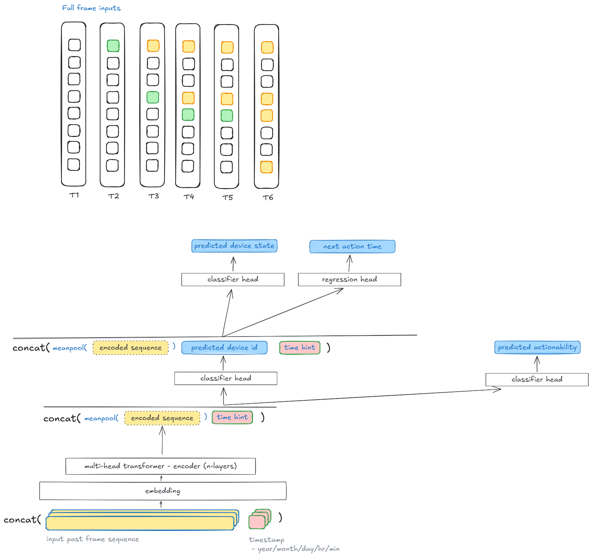

# Model exploration - full frame multi-head transformers



# CASAS dataset experiments

## Modeling Goal

Given a sequence in the past T window, predict what’s the user is going to do (an if they will do anything) and when they are going to do it. 

The prediction can serve as a reminder to the user (for sleeping, take medicine) or alert the care giver if they are about to do dangerous activities such as night wandering. 

## Dataset

[https://casas.wsu.edu/datasets/cairo.zip](https://casas.wsu.edu/datasets/cairo.zip)

The CASAS dataset (annotated) has 4 simple columns


The T sensors are temperature sensors, M sensors are motion sensors, additionally there are Area Motions that are also annotated with M.

This dataset contains sensor data that was collected in the home of a volunteer adult couple.  The residents in the home were a man, a woman, and a dog.  The couple's children also visited the home on at least one occasion.

The following activities are annotated within the dataset. The number in parentheses is the number of times the activity appears in the data.

Bed to toilet (30)
Breakfast (48)
R1 sleep (50)
R1 wake (53) 
R1 work in office (46)
Dinner (42)
Laundry (10)
Leave home (69)
Lunch (37)
Night wandering (67)
R2 sleep (52)
R2 take medicine (44)
R2 wake (52)

This should give us a robust dataset given their are friends, children and dog activities.

## Data transformations

[https://github.com/Home-Auto-Pilot/model-dev/blob/main/workspaces/CASAS-experiment/casas-transformer-slim.ipynb](https://github.com/Home-Auto-Pilot/model-dev/blob/main/workspaces/CASAS-experiment/casas-transformer-slim.ipynb)

### Mix-in Action Data into Sensor Data

Firstly, we need to simplify the dataset by making the activities special entities (think of it like if the user started to sleep, the switch for sleep turns on). This makes the sequence prediction easier because then we can mix-in activities into sensor sequence to make unified inputs to the model

```python
{'Night wandering': 'A002', 'Bed to toilet': 'A004', 'R1 wake': 'A006', 'R2 wake': 'A008', 'R2 take medicine': 'A010', 'Breakfast': 'A012', 'Leave home': 'A014', 'Lunch': 'A016', 'Dinner': 'A018', 'R2 sleep': 'A020', 'R1 sleep': 'A022', 'R1 work in office': 'A024', 'Laundry': 'A026'}
```

After mixing in the actions into sensor histories and also factorizing the categorical data (the entity states such as ‘on’/’off’)

```python
total 4: Index(['ON', 'OFF', 'begin', 'end'], dtype='object')
total 45: Index(['T003', 'T005', 'T004', 'T001', 'T002', 'M005', 'M006', 'M002', 'M009',
       'M011', 'M012', 'M022', 'M008', 'M007', 'M003', 'M010', 'M014', 'M015',
       'M023', 'M001', 'M024', 'M021', 'M016', 'M018', 'M020', 'M019', 'M013',
       'M025', 'M027', 'M017', 'M004', 'M026', 'A002', 'A004', 'A006', 'A008',
       'A010', 'A012', 'A014', 'A016', 'A018', 'A020', 'A022', 'A024', 'A026'],
      dtype='object')
                         timestamp  entity_id entity_value  sensor_change
0 2009-06-10 00:00:00.024668+00:00          0           19           True
1 2009-06-10 00:00:46.069471+00:00          1         18.5           True
2 2009-06-10 00:00:47.047655+00:00          0         18.5           True
3 2009-06-10 00:01:17.070215+00:00          1           18           True
4 2009-06-10 00:01:18.036049+00:00          2         19.5           True
5 2009-06-10 00:01:48.008924+00:00          2           20           True
6 2009-06-10 00:01:49.034019+00:00          0           19           True
7 2009-06-10 00:02:04.007968+00:00          2         19.5           True
8 2009-06-10 00:02:04.033741+00:00          0         18.5           True
9 2009-06-10 00:02:20.028116+00:00          2           20           True
```

### Create frames

Now we pivot the table by timestamp to create frames. The pivoted table will contain many NaN values because each row contains 1 values from the event by default. Hence we need to create a pseudo initial state (by just selecting the first ever values of all sensors in the history. 

```python
first_values = initial_values = merged_act_sensor_df.groupby('entity_id').first().sort_values(by='timestamp').reset_index()
```

```python
    entity_id                        timestamp entity_value  sensor_change
0           0 2009-06-10 00:00:00.024668+00:00           19           True
1           1 2009-06-10 00:00:46.069471+00:00         18.5           True
2           2 2009-06-10 00:01:18.036049+00:00         19.5           True
3           3 2009-06-10 00:41:04.052911+00:00         21.5           True
4           4 2009-06-10 00:41:35.035429+00:00         21.5           True
5           5 2009-06-10 01:28:39.066357+00:00            0           True
6          32 2009-06-10 03:20:59.087874+00:00            2          False
7           6 2009-06-10 03:20:59.087874+00:00            0           True
8           7 2009-06-10 03:21:01.038931+00:00            0           True
9           8 2009-06-10 03:21:08.033939+00:00            0           True
10          9 2009-06-10 03:22:13.008367+00:00            0           True
11         10 2009-06-10 03:22:14.000398+00:00            0           True
12         11 2009-06-10 03:22:19.001209+00:00            0           True
13         33 2009-06-10 03:45:16.046068+00:00            2          False
14         12 2009-06-10 03:45:58.025177+00:00            0           True
15         13 2009-06-10 03:46:04.027878+00:00            0           True
16         14 2009-06-10 03:57:41.080713+00:00            0           True
17         15 2009-06-10 03:58:06.043117+00:00            0           True
18         16 2009-06-10 03:58:09.066935+00:00            0           True
19         17 2009-06-10 03:58:11.070171+00:00            0           True
20         18 2009-06-10 03:58:11.095012+00:00            0           True
21         34 2009-06-10 05:46:00.080752+00:00            2          False
22         19 2009-06-10 05:48:57.026788+00:00            0           True
23         20 2009-06-10 05:50:07.028075+00:00            0           True
24         21 2009-06-10 05:50:11.080955+00:00            0           True
25         22 2009-06-10 05:53:13.065823+00:00            0           True
26         23 2009-06-10 05:54:00.002801+00:00            0           True
27         24 2009-06-10 05:54:02.013806+00:00            0           True
28         25 2009-06-10 05:54:02.030982+00:00            0           True
29         35 2009-06-10 05:59:10.006592+00:00            2          False
30         36 2009-06-10 06:19:50.009353+00:00            2          False
31         26 2009-06-10 06:20:03.062033+00:00            0           True
32         27 2009-06-10 06:24:12.095685+00:00            0           True
33         28 2009-06-10 06:24:18.043211+00:00            0           True
34         37 2009-06-10 06:27:30.088871+00:00            2          False
35         29 2009-06-10 07:00:23.016555+00:00            0           True
36         30 2009-06-10 07:30:34.085766+00:00            0           True
37         38 2009-06-10 08:27:37.001867+00:00            2          False
38         31 2009-06-10 11:14:21.084342+00:00            0           True
39         39 2009-06-10 12:22:58.008051+00:00            2          False
40         40 2009-06-10 18:02:56.039812+00:00            2          False
41         41 2009-06-10 19:53:32.009593+00:00            2          False
42         42 2009-06-10 20:54:09.002574+00:00            2          False
43         43 2009-06-12 06:36:20.098057+00:00            2          False
44         44 2009-06-18 12:16:37.015396+00:00            2          False
```

We then forward fill to propagate the last known state for each entity over-time with pandas’ [`ffill](https://pandas.pydata.org/docs/reference/api/pandas.DataFrame.ffill.html)()` function. 

Additionally, we added some current time hints: `month of year`, `week of month`, `day of week`, `hour`, `min`, `second`. Instead of using the raw timestamp, this might be more robust to help the model learn seasonal changes. We also added `timedelta_from_last_event` to get some sense of time gaps from last event (sensor or action entities). All of these are to help provide some orientation to the model. 

```python
	0	1	2	3	4	5	32	6	7	8	...	changed_entity_id	changed_entity_value	sensor_change	second	minute	hour	dayofweek	weekofmonth	monthofyear	timedelta_from_last_event
1	19	18.5	19.5	21.5	21.5	0	2	0	0	0	...	1	18.5	True	46	0	0	10	2	6	46.0
2	18.5	18.5	19.5	21.5	21.5	0	2	0	0	0	...	0	18.5	True	47	0	0	10	2	6	0.0
3	18.5	18	19.5	21.5	21.5	0	2	0	0	0	...	1	18	True	17	1	0	10	2	6	30.0
4	18.5	18	19.5	21.5	21.5	0	2	0	0	0	...	2	19.5	True	18	1	0	10	2	6	0.0
5	18.5	18	20	21.5	21.5	0	2	0	0	0	...	2	20	True	48	1	0	10	2	6	29.0
```

Alternatively, if we have limited data, we might want to use just the positional encoding. But we do have 2 years of data here, so this might be simpler.

### Create Sequence of Frames

To create sequences of frames, we need to define the window size first. I have tiny GPU memories (4gb) so I set it to 5 mins only to avoid crossing ram/gddr. Ideally longer the sequence length the better context it provides.

```python
    start_time_window = end_time - window_size
    
    # Get the past T minutes of snapshots (keep multi-dimensional structure)
    sequence = snapshot_df[(snapshot_df['timestamp'] > start_time_window) & 
                           (snapshot_df['timestamp'] < end_time)]
```

Each sequence entry contains the following columns. The `row` represent the **current event**, which is not included in the sequence.

```python
{
        'timestamp': end_time,
        'sequence': sequence_bytes,  # Storing as bytes
        'changed_entity_id': row['changed_entity_id'],
        'changed_entity_value': row['changed_entity_value'],
        'sensor_change': row['sensor_change'],
        'month': row['monthofyear'],
        'week': row['weekofmonth'],
        'day': row['dayofweek'],
        'hour': row['hour'],
        'min': row['minute'],
        'secs_from_last': row['timedelta_from_last_event'],
    }
```

```python
timestamp	sequence	changed_entity_id	changed_entity_value	sensor_change	month	week	day	hour	min	secs_from_last
0	2009-07-30 07:35:28.059671+00:00	b'PK\x03\x04\x00\x00\x08\x08\x00\x00\x00\x00\x...	35	2	False	7	5	30	7	35	0.0
1	2009-07-30 07:45:32.055391+00:00	b'PK\x03\x04\x00\x00\x08\x08\x00\x00\x00\x00\x...	35	3	False	7	5	30	7	45	0.0

```

After this, each `row` in the dataset represent the current event, and the history sequence context that leads to this current event. 

## Model Design

We use a multi-head transformer encoder as our backbone and rely on different classification/regression heads for predictions from the transformer output.

```python
TransformerMultiTask(
  (embedding): Linear(in_features=46, out_features=512, bias=True)
  (transformer): TransformerEncoder(
    (layers): ModuleList(
      (0): TransformerEncoderLayer(
        (self_attn): MultiheadAttention(
          (out_proj): NonDynamicallyQuantizableLinear(in_features=512, out_features=512, bias=True)
        )
        (linear1): Linear(in_features=512, out_features=2048, bias=True)
        (dropout): Dropout(p=0.1, inplace=False)
        (linear2): Linear(in_features=2048, out_features=512, bias=True)
        (norm1): LayerNorm((512,), eps=1e-05, elementwise_affine=True)
        (norm2): LayerNorm((512,), eps=1e-05, elementwise_affine=True)
        (dropout1): Dropout(p=0.1, inplace=False)
        (dropout2): Dropout(p=0.1, inplace=False)
      )
    )
  )
  (actionable_fc): Linear(in_features=517, out_features=2, bias=True)
  (entity_id_fc): Sequential(
    (0): Linear(in_features=517, out_features=256, bias=True)
    (1): SiLU()
    (2): Linear(in_features=256, out_features=45, bias=True)
  )
  (entity_state_fc): Sequential(
    (0): Linear(in_features=562, out_features=256, bias=True)
    (1): SiLU()
    (2): Linear(in_features=256, out_features=4, bias=True)
  )
  (action_time_regression): Linear(in_features=562, out_features=1, bias=True)
)
```

### Transformer encoder

Each frame in the sequence is embedded using the linear layer, plotting each frame to a much higher dimension, in this case 46 to 512. 

The transformer takes only the sequence embedding, such that it could attend to the important details in the sequence. Since it’s an encoder-only architecture, it outputs `batch` dimension of outputs and we need a way to squeeze it into a 1-d embedding for later classification/regression tasks. Here we simply uses mean-pooling, but we could also use BERT’s technique to add a stop token at the end of the input sequence and then use the last steps’ encoded output. 

### Classification heads

We have entity_id, entity_state and actionability classification tasks and the action time prediction task. 

The time prediction is just a simple linear regression layer. The id and state classification is a 2-layer MLP with SiLU activations. 

The **entity_id classifier** takes in the `encoded sequence` from the transformer encoder, plus the current `time hints` (min, hour, day, week, month).  The **entity_state classifier** takes in the output of the `entity_id predictions` (not the softmax), the `encoded sequence` and the `time hints` as input. The reason of taking the `entity_id_prediction` as input is because we wanted to make the state prediction task easier by providing the entity information.

### Loss Functions

All classification heads uses `CrossEntropyLoss` and the next action time regression uses `MSELoss`. We created a weighted total loss function which is heavily focusing on the entity_id prediction since it’s an powerful input to the downstream predictions.

```python
# Actionable Classification Criterion (binary classification)
actionable_classification_criterion = nn.CrossEntropyLoss()

# Entity ID Classification Criterion (multi-class classification)
entity_id_classification_criterion = nn.CrossEntropyLoss()

# Entity State Classification Criterion (multi-class classification)
entity_state_classification_criterion = nn.CrossEntropyLoss()

# Time Prediction Criterion (regression)
time_pred_regression_criterion = nn.MSELoss()

# entity_id and state cotrain loss
total_loss = entity_id_loss * 8 + entity_state_loss * 2
```

### Separate Training Process

We decided to train the entity_id and entity_state classification first because these are fundamental inputs to the actionable and time prediction heads, it’s more important to get them right. 


With 100 Epochs we are seeing the model is pretty much converged at 97% accuracy

```python
Epoch [128/128], Loss: 0.5889, Entity ID Acc: 99.1525%, Entity state Acc: 95.76%
```

Then we freeze the transformer parameters and move on to train the actionability predictions

```python

```

## TODO

- [x]  add current frame to the training data (currently missing from the data)
- this doesn’t provide much help other than making it slower because the intricacies should have already been learned better in the transformer block
- [x]  fixe the time prediction target (currently it’s always 0 because it was on a fake action node that’s using the same timestamp as the last sensor data point)
- This is fixed, but the time prediction then proved to be impossible to converge because it’s too wide of range and discrete. Some other ideas is to force the time to be 0 (execute immediately) or categorize them into buckets (in 3, in 5, in 10, in 60…
- [ ]  create sensor dataset to train the actionability with only the MLP in the actionability prediction head